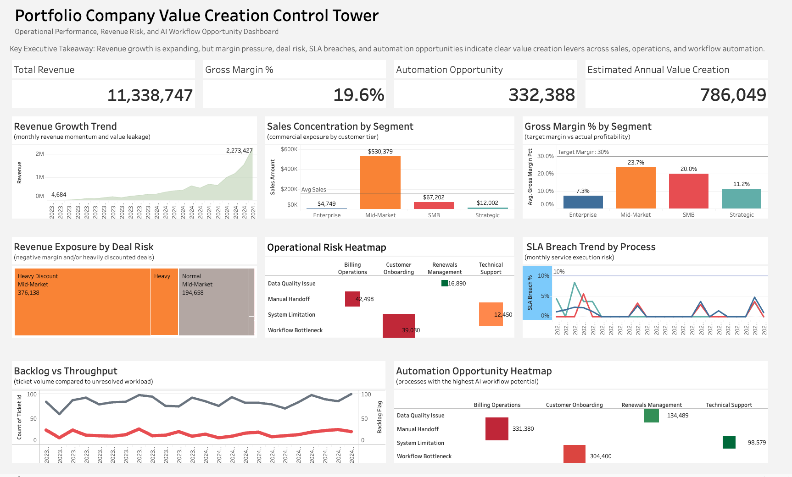
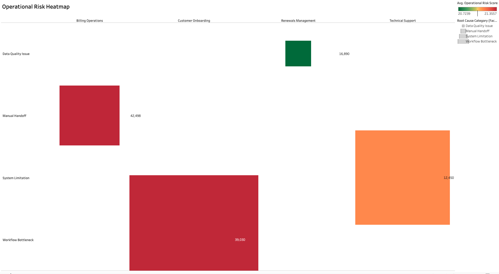
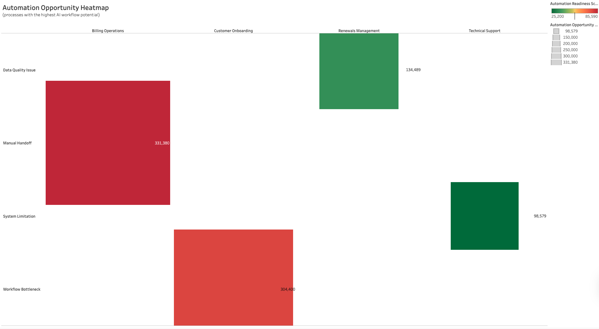
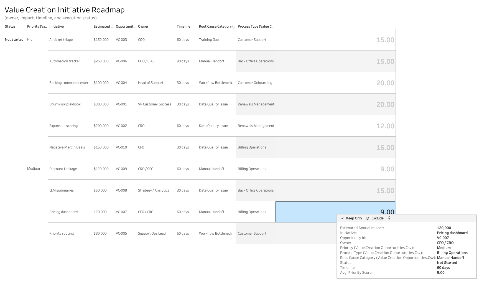

# Portfolio Company Value Creation Control Tower

## Overview

This project simulates the type of portfolio monitoring framework used by private equity sponsors, private credit investors, and portfolio operations teams to evaluate operating performance, identify value creation opportunities, and monitor execution risk across a portfolio company.

The dashboard consolidates commercial, operational, and workflow metrics into a single executive reporting environment designed to support management reviews, operating committee discussions, and investment decision-making.

LINK: https://public.tableau.com/views/PortfolioControlTower/PortfolioCompanyValueCreationControlTower?:language=en-US&:sid=&:redirect=auth&:display_count=n&:origin=viz_share_link
---

## Executive Dashboard

### Key Metrics Monitored

* Revenue Performance
* Gross Margin Performance
* Operational Risk
* Workflow Efficiency
* SLA Compliance
* Automation Potential
* Value Creation Opportunity Pipeline

---

## Analytical Objective

The purpose of the analysis is to identify where management attention and capital should be allocated to improve portfolio company performance.

The framework focuses on four questions:

1. Where is value being created?
2. Where is value being lost?
3. Which risks require intervention?
4. Which initiatives generate the highest return on effort?

---

## Dashboard Components

### Revenue Growth Trend

Tracks monthly revenue performance and identifies growth acceleration, concentration risk, and potential value leakage.

### Sales Concentration by Segment

Measures commercial exposure across customer segments and highlights revenue dependency.

### Gross Margin Analysis

Evaluates profitability performance against target margin thresholds.

### Revenue Exposure by Deal Risk

Identifies revenue associated with heavily discounted or economically unattractive transactions.

### Operational Risk Heatmap

Highlights operational risk concentrations by business process and root cause category.

### SLA Breach Trend

Measures service execution performance and identifies periods of elevated operational risk.

### Backlog vs Throughput

Compares incoming workload against operational processing capacity.

### Automation Opportunity Heatmap

Prioritizes processes with the largest potential efficiency gains from automation and workflow redesign.

---

## Value Creation Initiative Roadmap

The roadmap converts analytical findings into prioritized initiatives based on:

* Expected financial impact
* Operational complexity
* Execution timeline
* Functional ownership
* Strategic importance

Example initiatives include:

* AI Ticket Triage
* Workflow Automation
* Pricing Optimization
* Churn Reduction Programs
* Customer Lifecycle Improvements
* Support Process Standardization

---

## Investment Perspective

The analysis suggests several areas of focus:

### Commercial Performance

Revenue growth is concentrated within a limited number of customer segments, creating concentration exposure and dependency risk.

### Margin Performance

Several segments operate below target margin thresholds, indicating opportunities for pricing discipline and cost optimization.

### Operational Performance

Manual handoffs, workflow bottlenecks, and data quality issues represent recurring operational friction points.

### Value Creation

Targeted automation and process redesign initiatives present meaningful opportunities to improve operating leverage and reduce execution risk.

---

## Repository Contents

| File                         | Description                       |
| ---------------------------- | --------------------------------- |
| dashboard_overview.png       | Executive control tower           |
| operational_risk_heatmap.png | Operational risk analysis         |
| automation_heatmap.png       | Automation opportunity analysis   |
| value_creation_roadmap.png   | Initiative prioritization roadmap |
| README.md                    | Project documentation             |

---

## Technology

* Tableau Public
* Excel
* Business Performance Analytics
* Portfolio Operations Analytics
* Operational Risk Monitoring
* Value Creation Frameworks

---

## Author

Jalaan Fields

Portfolio Analytics • Value Creation • Business Performance Management • Strategic Decision Support
